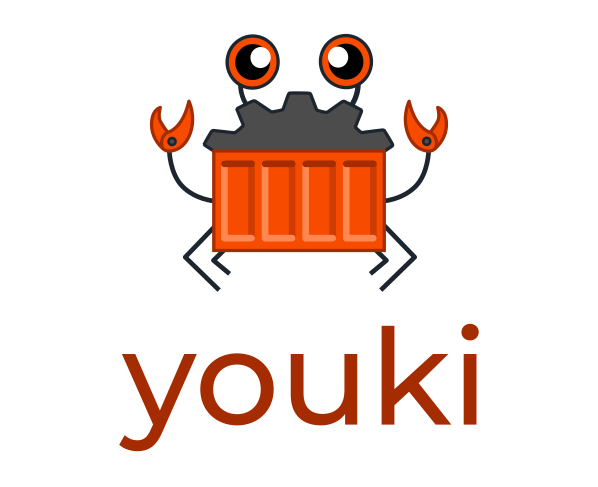

# youki: A container runtime in Rust



> rusty container

youki (pronounced as /joʊki/ or yoh-key) is an implementation of [runtime-spec](https://github.com/opencontainers/runtime-spec) in Rust, referring to [runc](https://github.com/opencontainers/runc).
youki is named after a Japanese word 'youki', which means 'a container'. In Japanese language, youki also means 'cheerful', 'merry', or 'hilarious'.

# Motivation

Here is why I am rewriting a new container runtime in Rust.

- Rust is one of the best languages to implement oci-runtime. Many container tools are written in Go. It's all very nice products. However, the container runtime requires the use of system calls, which requires a bit of special handling when implemented in Go. This is too tricky(e.g. _namespaces(7)_, _fork(2)_); with Rust, it's not that tricky and you can use system calls. Also, unlike C, Rust provides the benefit of memory management. Rust is not yet a major player in the container field, and Rust has the potential to contribute more to this field. I hope to be one of the examples of how Rust can be used in this field.
- youki has the potential to be faster and use less memory than runc. This means that it can work in environments with tight memory usage. I don't have any benchmarks, etc., as it is not yet fully operational, but I expect that it will probably perform better when implemented in Rust. In fact, [crun](https://github.com/containers/crun#performance), a container runtime implemented in C, is quite high performance. For example, it may be possible to experiment with asynchronous processing using async/await in some parts.
- The development of [railcar](https://github.com/oracle/railcar) has been suspended. This project was very nice but is no longer being developed. This project is inspired by it.
- I have fun implementing this. In fact, this may be the most important.

# Status of youki

youki is not at the practical stage yet. However, it is getting closer to practical use, running with docker and passing all the default tests provided by [opencontainers/runtime-rools](https://github.com/opencontainers/runtime-tools).


# Getting Started

Local build is only supported on linux.
For other platforms, please use the devcontainer that we prepared.

## Requires

- Rust(See [here](https://www.rust-lang.org/tools/install))
- Docker

## Building

```sh
$ git clone git@github.com:utam0k/youki.git
$ cd youki
$ cargo build
```

## Usage

Starting the docker daemon.

```
$ dockerd --experimental --add-runtime="youki=$(pwd)/target/x86_64-unknown-linux-gnu/debug/youki"
```

You can use youki in a different terminal to start the container.

```
$ docker run -it --rm --runtime youki busybox
```

### Integration test

You can use [opencontainers/runtime-rools](https://github.com/opencontainers/runtime-tools) to do integration testing used in CI.
See it's documentation for details.

# Design and implementation of youki

TBD

# Features

- [x] run with docker
- [x] pivot root
- [x] mount devices
- [x] namespace
- [x] capabilities
- [x] rlimits
- [ ] cgroups v1
  - [x] devices
  - [ ] cpu
  - [ ] cpuacct
  - [ ] cpuset
  - [ ] memory
  - [ ] freezer
  - [ ] net_cls
  - [ ] blkio
  - [ ] perf_event
  - [ ] net_prio
  - [ ] hugetlb
  - [ ] pids
  - [ ] rdma
- [ ] hooks

# Contribution

This project welcomes your PR and issues.
For example, refactoring, adding features, correcting English, etc.
If you need any help, you can contact me on [Twitter](https://twitter.com/utam0k).
