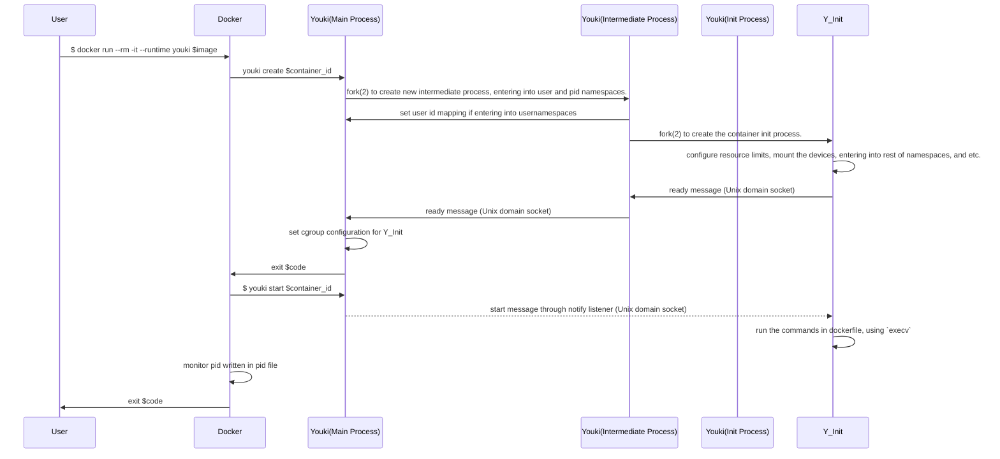

\_This is a draft for a high level documentation of Youki. After it is finished this is intended to explain how control flow and high level functioning of Youki happens for development purposes.

## Some reference links

These are references to various documentations and specifications, which can be useful to understand commands and constraints.

- [OCI runtime specification](https://github.com/opencontainers/runtime-spec/blob/master/runtime.md) : The specification for a container runtime. Any OCI complaisant runtime must follow this.
- [runc man pages](https://github.com/opencontainers/runc/tree/master/man) : Has description on commands and their options in runc.
- [cgroups man page](https://man7.org/linux/man-pages/man7/cgroups.7.html) : Contains information about cgroups, their creation, deletion etc.
- [pseudoterminal man page](https://man7.org/linux/man-pages/man7/pty.7.html) : Information about the pseudoterminal system, useful to understand console_socket parameter in create subcommand
- [Unix Sockets man page](https://man7.org/linux/man-pages/man7/unix.7.html) : Useful to understand sockets
- [prctl man page](https://man7.org/linux/man-pages/man2/prctl.2.html) : Process control man pages
- [OCI Linux spec](https://github.com/opencontainers/runtime-spec/blob/master/config-linux.md) : Linux specific section of OCI Spec
- [pipe2 man page](https://man7.org/linux/man-pages/man2/pipe.2.html) : Definition and usage of pipe2
- [systemd resource control](https://www.freedesktop.org/software/systemd/man/systemd.resource-control.html): Options offered by systemd for resource control

---

## Control flow diagram

This is diagram as given in #14, which is not actually how this works, but helpful to understand overall flow. Someone needs to check and correct.

---

## Control flow

### main invocation

On invoking Youki, main function parses args passed to it, which contains directory path to store container state (check runc . 8 . md in [runc man pages]), optional log path and log format string and a subcommand such as create, delete etc.

From there it matches subcommand arg with possible subcommand and takes appropriate actions, such as creating a new container, deleting a container, etc.

### create container

One thing to note is that in the end, a container is just another process in Linux, which has control groups, namespaces, pivot_root and other mechanisms applied to it. The program executing has the impression that is is running on a complete system, but from the host system's perspective, it is just another process, and has attributes such as pid, file descriptors, etc. associated with it like any other process.

When given the create command, Youki will load the specification, configuration, sockets etc., use clone syscall to create the container process (init process), applies the limits, namespaces, and etc. to the cloned container process. The container process will wait on a unix domain socket before executing the command/program.

The main youki process will setup pipes to communicate and synchronize with the intermediate and init process. The init process will notify the intermediate process, and then intermediate process to the main youki process that it is ready and start to wait on a unix domain socket. The youki process will then write the container state and exit.

- [mio Token definition](https://docs.rs/mio/0.7.11/mio/struct.Token.html)
- [oom-score-adj](https://dev.to/rrampage/surviving-the-linux-oom-killer-2ki9)
- [unshare man page](https://man7.org/linux/man-pages/man1/unshare.1.html)
- [user-namespace man page](https://man7.org/linux/man-pages/man7/user_namespaces.7.html)
- [wait man page](https://man7.org/linux/man-pages/man3/wait.3p.html)

### Process

This handles creation of the container process. The main youki process creates the intermediate process and the intermediate process creates the container process (init process). The hierarchy is: `main youki process -> intermediate process -> init process`

The main youki process will set up pipes used as message passing and synchronization mechanism with the init process. The reason youki needs to create/fork two process instead of one is due to the user and pid namespaces. In rootless container, we need to first enter user namespace, since all other namespaces requires CAP_SYSADMIN. When unshare or set_ns into pid namespace, only the children of the current process will enter into a different pid namespace. As a result, we must first fork a process to enter into user namespace, call unshare or set_ns for pid namespace, then fork again to enter into the correct pid namespace.

Note: clone(2) offers us the ability to enter into user and pid namespace by creatng only one process. However, clone(2) can only create new pid namespace, but cannot enter into existing pid namespaces. Therefore, to enter into existing pid namespaces, we would need to fork twice. Currently, there is no getting around this limitation.

- [fork(2) man page](https://man7.org/linux/man-pages/man2/fork.2.html)
- [clone(2) man page](https://man7.org/linux/man-pages/man2/clone.2.html)
- [pid namespace man page](https://man7.org/linux/man-pages/man7/pid_namespaces.7.html)

### Container

This structure contains functions related to container process and its state and status.

### Command

This contains a trait to wrap commonly required syscalls, so that they can be abstracted from implementation details for rest of Youki.
This also provides implementation for Linux syscalls for the trait.

- [pivot_root man page](https://man7.org/linux/man-pages/man2/pivot_root.2.html)
- [umount2 man page](https://man7.org/linux/man-pages/man2/umount2.2.html)
- [capabilities man page](https://man7.org/linux/man-pages/man7/capabilities.7.html)
- [unshare man page](https://man7.org/linux/man-pages/man2/unshare.2.html)

## Capabilities

This has functions related to set and reset specific capabilities, as well as to drop extra privileges

- [Simple explanation of capabilities](https://blog.container-solutions.com/linux-capabilities-in-practice)
- [man page for capabilities](https://man7.org/linux/man-pages/man7/capabilities.7.html)

## Info

This is primarily for printing info about system running youki, such as OS release, architecture, cpu info, cgroups info etc. , as this info can be helpful when reporting issues.

- [about /etc/os-release](https://www.freedesktop.org/software/systemd/man/os-release.html)

## Namespaces

This has functions related to setting of namespaces to the calling process

- [CLONE_NEWUSER flag](https://man7.org/linux/man-pages/man2/clone.2.html)

## Pause and Resume

This contains functionality regarding pausing and resuming container. Pausing a container indicates suspending all processes in it. This can be done with signals SIGSTOP and SIGCONT, but these can be intercepted. Using cgroups to suspend and resume processes without letting tasks know.

- [cgroups man page](https://man7.org/linux/man-pages/man7/cgroups.7.html)
- [freezer cgroup kernel documentation](https://www.kernel.org/doc/Documentation/cgroup-v1/freezer-subsystem.txt)

## Other references

- [oci runtime specification](https://github.com/opencontainers/runtime-spec/blob/master/runtime.md)
- [runc man pages](https://github.com/opencontainers/runc/blob/master/man/runc.8.md)
