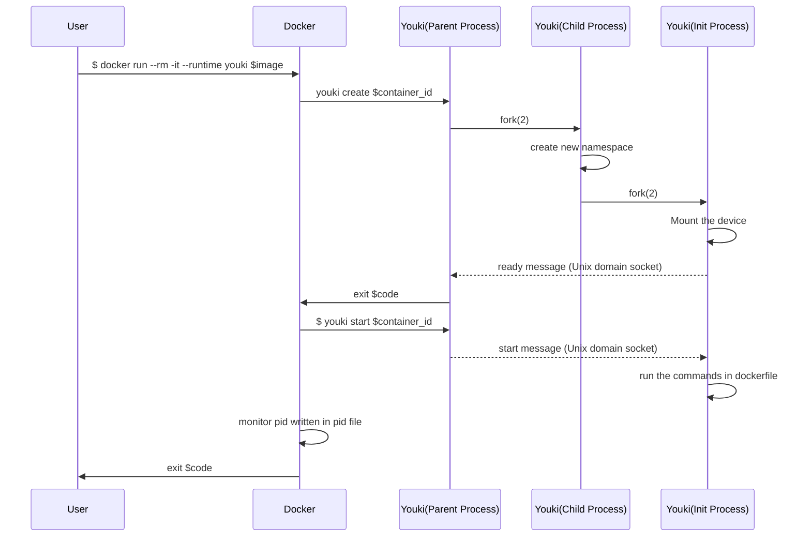

_This is a draft for a high level documentation of Youki. After finished this is intended to provide how control flow and high level functioning of Youki happens for development purposes._

## Some reference links

These are references to various documentations and specifications, which can be useful to understand commands and constraints.

- [OCI runtime specification] : The specification for a container runtime. Any OCI complaisant runtime must follow this.
- [runc man pages] : has information on various commandline options supported by runc, can be used to understand commands and their options.
- [cgroups man page](https://man7.org/linux/man-pages/man7/cgroups.7.html) : contains information about cgroups, their creation, deletion etc.
- [pseudoterminal man page](https://man7.org/linux/man-pages/man7/pty.7.html) : Information about the pseudoterminal system, useful to understand console_socket parameter in create subcommand
- [Unix Sockets man page](https://man7.org/linux/man-pages/man7/unix.7.html) : Useful to understand sockets
- [prctl man page](https://man7.org/linux/man-pages/man2/prctl.2.html) : Process control man pages
- [OCI Linux spec](https://github.com/opencontainers/runtime-spec/blob/master/config-linux.md) : Linux specific section of OCI Spec

---

## Control flow diagram

This is diagram as given in #14, which is not actually how this works, but helpful to understand overall flow. Someone needs to check and correct.

---

## Control flow

### main invocation

On invoking Youki, main function parses args passed to it, which contains directory path to store container state (check runc . 8 . md in [runc man pages]), optional log path and log format string and a subcommand such as create, delete etc.

From there it matches subcommand arg with possible subcommand and takes appropriate actions, such as creating a new container, deleting a container erc.

### create container

One thing to note is that in the end, container is just another process in Linux. It has specific/different control group, namespace, using which program executing in it can be given impression that is is running on a complete system, but on the system which it is running, it is just another process, and has attributes such as pid, file descriptors, etc. associated with it like any other process.

When given create command, Youki will load the specification, configuration, sockets etc.
forks the process into parent an child (C1), forks the child process again (C2), applies the limits, namespaces etc to the child of child (C2)process ,and runs the command/program in the C2. After the command / program is finished the C2 returns. The C1 is waiting for the C2 to exit, after which it also exits.

[oci runtime specification]: https://github.com/opencontainers/runtime-spec/blob/master/runtime.md
[runc man pages]: (https://github.com/opencontainers/runc/blob/master/man/runc.8.md)
