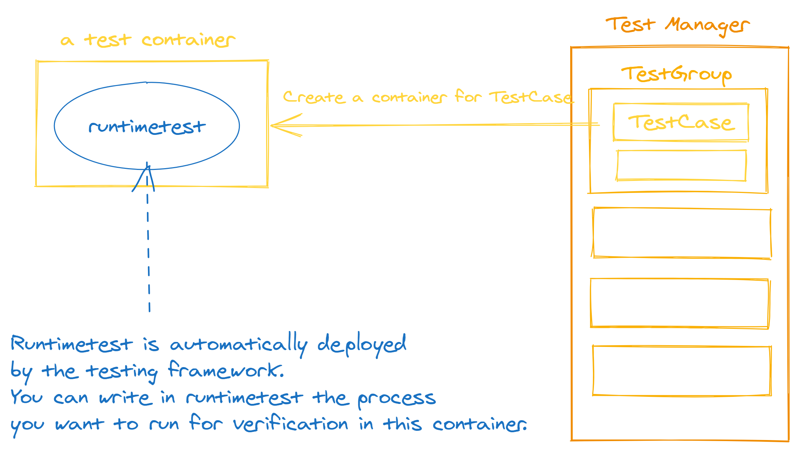

# rust oci tests

This is youki's original integration to verify the behavior of the low-level container runtime.



# How to run

```console
just rust-oci-tests
```

# How to write

We will not go into detail here, but will explain how to write and add a new test vase based on an example test.

<details>
<summary>Fully the code of the example test</summary>
<p>

```rust,no_run,noplayground
{{#include ../../../../tests/rust-integration-tests/integration_test/src/tests/example/hello_world.rs}}
```

</p>
</details>


1. Build the OCI Runtime Spec you want to verify

    This testing framework automatically places [runtimetest](./runtimetest.md) in the container.
    In other words, you can test the processes you want to execute within a container by writing them in runtimetest.
    Therefore, it is common practice here to write an OCI Runtime Spec that executes `runtimetest`.

```rust,no_run,noplayground
{{#include ../../../../tests/rust-integration-tests/integration_test/src/tests/example/hello_world.rs:get_example_spec}}
```

2. Prepare a function that returns a `TestResult`, which represents the result of the test.

```rust,no_run,noplayground
{{#include ../../../../tests/rust-integration-tests/integration_test/src/tests/example/hello_world.rs:example_test}}
```

3. Create a `TestGroup` and register a test case you created

```rust,no_run,noplayground
{{#include ../../../../tests/rust-integration-tests/integration_test/src/tests/example/hello_world.rs:get_example_test}}
```

4. Register the `TestGroup` you created to a `TestManager`

```rust,no_run,noplayground
{{#include ../../../../tests/rust-integration-tests/integration_test/src/main.rs:register_example_test}}
```

5. Write the validation you want to run within a test container
```rust,no_run,noplayground
{{#include ../../../../tests/rust-integration-tests/runtimetest/src/main.rs:example_runtimetest_main}}
```
```rust,no_run,noplayground
{{#include ../../../../tests/rust-integration-tests/runtimetest/src/tests.rs:example_hello_world}}
```
